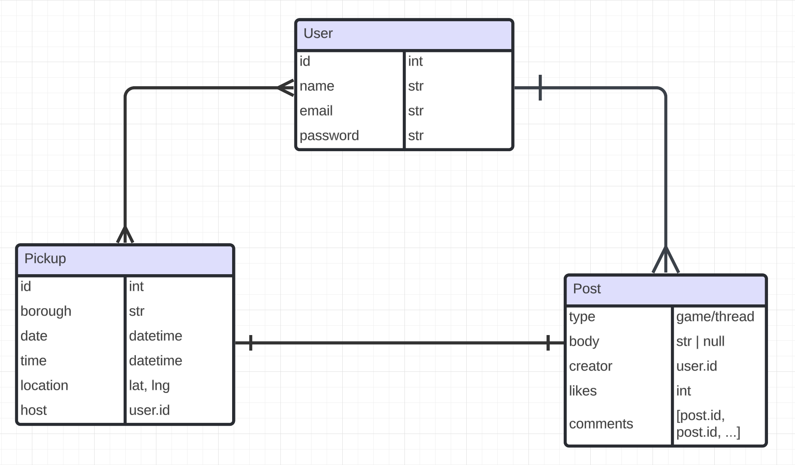

# Entity Relationship Diagram

## Create the List of Tables

### Pickup
| Column Name | Type | Description |
|-------------|------|-------------|
| id | int | primary key |
| borough | text | pickup borough |
| count | int | num of players signed up |
| capacity | int | max num of players |
| date | date | pickup date |
| time | time | pickup time |
| loc | lng,lat | game location |
| host | user_id | creator's user.id |

### User
| Column Name | Type | Description |
|-------------|------|-------------|
| id | int | primary key |
| name | text | username |
| email | text | user email. not null |
| password | text | user password. not null |

### Post
| Column Name | Type | Description |
|-------------|------|-------------|
| id | int | primary key |
| type | game/thread | the post type. post can be either text thread or game/pickup post |
| body | string | content of the post. If thread post, then string else json object of game details |
| creator | user.id | user.id (foreign key) of creator |
| likes | int | num of post likes |

### Pickups_Users
This table is intended to connect a pickup game with all the signed-up users
Note: Each instance represents one relationship. There might be multiple instances of entries with the same pickup_id, but only one entry with a combination of a user instance and a pickup instance
| Column Name | Type | Description |
|-------------|------|-------------|
| pickup_id | pickup.id | foreign key to pickup game |
| user_id | user.id | forgeign key to a user |